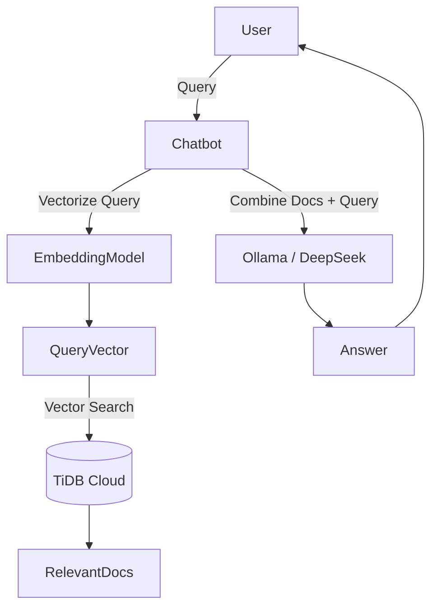

# Smart-Chatbot-with-Retrieval-Augmented-Generation

# Chatbot RAG dengan TiDB Cloud + Ollama (DeepSeek)
chatbot **anti-halusinasi** dengan pendekatan **Retrieval-Augmented Generation (RAG)**.  
Chatbot ini menggabungkan **Large Language Model (LLM)** (via Ollama/DeepSeek) dengan **knowledge base** yang kita simpan di **TiDB Cloud** menggunakan vector search.

## Deskripsi
- **Masalah**: LLM seperti ChatGPT atau Gemini tidak bisa mengetahui data internal perusahaan.
- **Solusi**: Menggunakan **RAG**, yaitu menggabungkan hasil retrieval dari database (knowledge internal) ke dalam prompt LLM.
- **Hasil**: Chatbot dapat menjawab pertanyaan berdasarkan data yang kita sediakan (CSV → embedding → vector DB).

## 🛠️ Tools & Stack
- **Database**: [TiDB Cloud](https://tidbcloud.com/) (serverless, gratis 5GB, mendukung `VECTOR(1024)`)
- **LLM**: [DeepSeek](https://www.deepseek.com/) via [Ollama](https://ollama.com/) client
- **Python**:
  - `sentence-transformers` (untuk embedding, model `BAAI/bge-m3`)
  - `mysql-connector-python` (untuk connect ke TiDB)
  - `pandas` (olah CSV knowledge base)
  - `json` (simpan embedding dalam string)
- **IDE**: Visual Studio Code

## ⚙️ Arsitektur RAG

